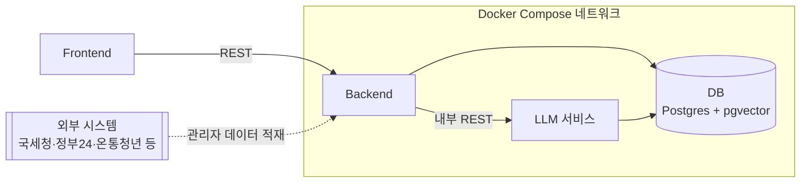
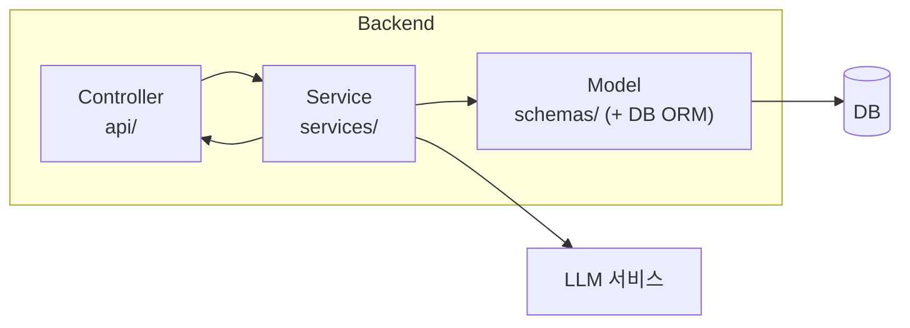

# 시스템 아키텍처

전체 서비스 구성과 Backend 내부 계층(MVC + Service) 구조를 정리한다. 컴포넌트 간 상세 호출 흐름은 `Docs/SEQUENCE.md`를 참고한다.

## 1. 전체 시스템 구성도

- **Frontend → Backend**: 외부에 노출되는 유일한 진입점. `Docs/API_SPEC.md`의 엔드포인트를 Backend가 REST로 제공한다.
- **Backend → LLM**: LLM 서비스는 외부에 직접 노출하지 않고, Backend가 Docker 내부 네트워크에서 서비스명으로 호출한다(예: `http://llm:8001/...`). RAG 질의응답, 세액감면판정 근거 생성, 공고문 요약, 영수증 OCR 등 AI 작업을 담당한다.
- **DB**: 관계형 데이터(`Docs/ERD.md`)와 벡터 데이터를 Postgres + pgvector로 통합해 컨테이너 하나로 관리한다. Backend와 LLM이 각자 필요한 부분(일반 데이터/벡터 검색)에 직접 접속한다.
- **외부 시스템**: 국세청·정부24·온통청년 등에서 받아온 세법·정책 원문은 관리자 기능(FS-26)을 통해 Backend로 적재된다.

## 2. Backend 내부 계층 구조 (MVC + Service)

`Backend/`에 이미 만들어진 `api/`, `core/`, `schemas/`, `services/` 폴더에 MVC 역할을 매핑한다.

| 계층 | 폴더 | 역할 |
| --- | --- | --- |
| Controller | `Backend/api` | 요청 수신, 라우팅, 입력 검증 후 Service 호출 |
| Service | `Backend/services` | 비즈니스 로직 (RAG 파이프라인 호출, 세액감면 판정 로직 등) |
| Model | `Backend/schemas` (+ DB ORM 모델) | 요청/응답 데이터 구조(Pydantic)와 DB 엔티티. DB ORM 모델을 담을 폴더는 아직 없어 필요 시 `Backend/models` 추가를 검토한다 |
| View | (별도 폴더 없음) | REST API라 HTML 뷰가 없고, Controller가 반환하는 `schemas`의 응답 모델이 View 역할을 겸한다 |
| 공통 인프라 | `Backend/core` | 설정, DB 세션, 공통 유틸 — 위 계층을 지원 |

고전 MVC와 다른 점: ①화면을 그리는 View가 없고 JSON 응답 스키마가 그 역할을 대신하며, ②비즈니스 로직을 Controller에서 분리한 Service 계층이 추가되어 있다(REST API에서 흔한 "MVC + Service" 변형).

`core/`는 위 세 계층 전반에서 공통으로 쓰는 설정·DB 세션·유틸을 제공하므로 흐름도에는 별도 노드로 표시하지 않았다.

## 3. LLM 서비스 내부 구조

`LLM/src/` 폴더를 역할별로 매핑한다.

| 폴더 | 역할 |
| --- | --- |
| `serving` | Backend가 호출하는 API 진입점 |
| `models` | LLM/임베딩 모델 로딩 및 추론 |
| `features` | 임베딩·전처리 (벡터화 등) |
| `data` | 세법·정책·공고문 원천 데이터 적재/가공 |

## 4. 통신·배포 노트

- Docker Compose 내부 네트워크에서 서비스명 기반 REST 통신 사용
- DB는 Postgres + pgvector로 통합해 별도 벡터DB 컨테이너 없이 운영
- 현재는 동기 REST 호출로 시작하고, 영수증 OCR·RAG 문서 재색인처럼 시간이 걸리는 작업은 향후 큐(Redis/Celery 등) 도입을 검토한다 — MVP 단계에서는 과설계를 지양한다

## 관련 문서

- 컴포넌트 간 상세 호출 흐름: `Docs/SEQUENCE.md`
- 데이터 구조: `Docs/ERD.md`
- API 명세: `Docs/API_SPEC.md`
