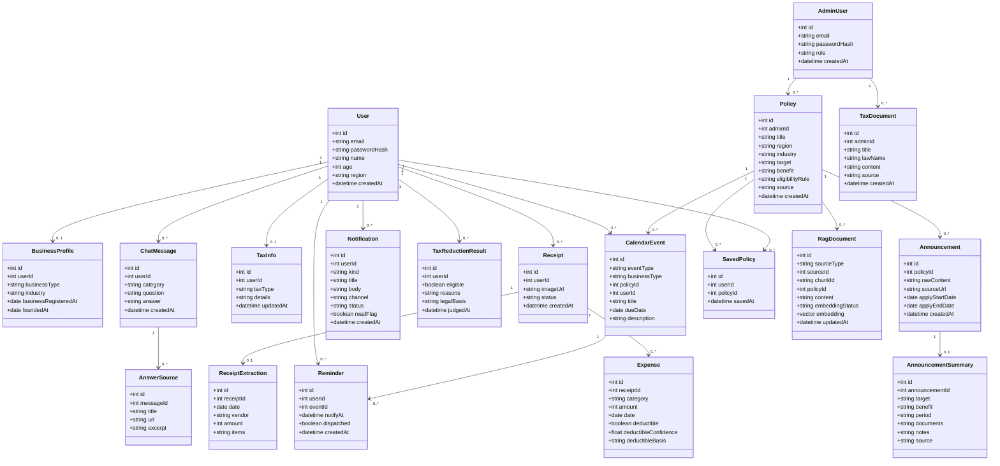

# 클래스 다이어그램

Backend를 구현할 작업자가 참고할 수 있도록 Model(도메인 모델)과 Service(비즈니스 로직) 두 계층의 클래스를 정리한다. `Docs/Design/ARCHITECTURE.md`가 정의한 Controller–Service–Model 구조 중 Controller는 `Docs/Design/API_SPEC.md`의 라우트와 거의 1:1이라 별도 다이어그램 없이 생략한다.

## 1. Model 클래스

`Docs/Design/ERD.md`의 엔티티를 도메인 객체로 재표현한 것이다. 속성만 표기하고 행위(메서드)는 두지 않는다 — `Docs/Design/ARCHITECTURE.md`가 Model 계층을 "요청/응답 데이터 구조(Pydantic)와 DB 엔티티"로 정의한 것과 같은 관점이다.

> 속성 타입, 제약(NOT NULL, UNIQUE, ON DELETE CASCADE 등)의 근거는 `Docs/Design/ERD.md`와 `DB/01_schema.sql`을 참고한다. 이 문서에서는 중복 기술하지 않는다. `RagDocument`는 참조 방식이 두 가지로 나뉜다. `sourceType`/`sourceId`는 여러 테이블을 가리키는 논리 참조라 DB FK가 없고 관계선도 두지 않는다. 반면 `policyId`는 `policies(id)`를 가리키는 실제 FK라 `Policy`와 관계선을 둔다.

## 2. Service 클래스

`Docs/Design/API_SPEC.md`의 8개 라우트 그룹(auth/users/chat/calendar/tax/expenses/policies/admin)과 1:1로 대응하는 Service 클래스다. 메서드는 각 그룹의 엔드포인트를 그대로 옮긴 것이다. `LLMServiceClient`는 `Docs/Design/ARCHITECTURE.md`·`Docs/Design/SEQUENCE.md`에 나온 Backend→LLM 내부 REST 호출을 추상화한 클래스로, LLM 서비스 자체의 내부 구조(`LLM/src/*`)는 다루지 않는다.

```mermaid
classDiagram
    class AuthService {
        +signup(email, password) User
        +login(email, password) Token
        +logout()
    }

    class UserService {
        +getProfile(userId) User
        +updateProfile(userId, data) User
        +getBusinessProfile(userId) BusinessProfile
        +updateBusinessProfile(userId, data) BusinessProfile
    }

    class ChatService {
        +sendMessage(userId, category, question) ChatMessage
        +getAnswerSources(messageId) AnswerSource[]
    }

    class CalendarService {
        +getEvents(userId, year, month, type) CalendarEvent[]
    }

    class TaxService {
        +diagnoseBusinessType(conditions) DiagnosisResult
        +getTaxInfo(userId) TaxInfo
        +updateTaxInfo(userId, data) TaxInfo
        +getReminders(userId) Reminder[]
        +createReminder(userId, eventId, notifyAt) Reminder
        +deleteReminder(reminderId)
        +checkTaxReduction(userId) TaxReductionResult
        +getTaxReductionResult(userId) TaxReductionResult
    }

    class ExpenseService {
        +registerReceipt(userId, image) Receipt
        +getReceiptExtraction(receiptId) ReceiptExtraction
        +getExpenses(userId, filters) Expense[]
        +getDeductibility(expenseId) DeductibilityResult
    }

    class PolicyService {
        +searchPolicies(filters) Policy[]
        +getRecommendations(userId) Policy[]
        +getPolicyDetail(policyId) Policy
        +checkEligibility(userId, policyId) EligibilityResult
        +getAnnouncementSummary(announcementId) AnnouncementSummary
        +savePolicy(userId, policyId)
        +getSavedPolicies(userId) Policy[]
    }

    class NotifyService {
        +listNotifications(userId) Notification[]
        +markRead(userId, notificationId)
        +markAllRead(userId)
        +pushNow(userId, payload)
    }

    class AdminService {
        +adminLogin(email, password) Token
        +getUsers(page) User[]
        +getUserDetail(userId) User
        +registerTaxDocument(data) TaxDocument
        +registerPolicy(data) Policy
        +registerAnnouncement(data) Announcement
        +reindexRagDocuments(documentIds)
        +getMonitoringData() Metrics
    }

    class LLMServiceClient {
        <<external>>
        +ragAnswer(question, category) Answer
        +explainLegalBasis(context) Explanation
        +extractReceipt(image) ReceiptFields
        +analyzeDeductibility(expense) DeductibilityResult
        +summarizeAnnouncement(content) Summary
        +reindex(documentIds)
    }

    AuthService ..> User
    AuthService ..> AdminUser
    UserService ..> User
    UserService ..> BusinessProfile
    ChatService ..> ChatMessage
    ChatService ..> AnswerSource
    ChatService ..> LLMServiceClient
    CalendarService ..> CalendarEvent
    CalendarService ..> Reminder
    TaxService ..> TaxInfo
    TaxService ..> TaxReductionResult
    TaxService ..> BusinessProfile
    TaxService ..> LLMServiceClient
    ExpenseService ..> Receipt
    ExpenseService ..> ReceiptExtraction
    ExpenseService ..> Expense
    ExpenseService ..> LLMServiceClient
    PolicyService ..> Policy
    PolicyService ..> Announcement
    PolicyService ..> AnnouncementSummary
    PolicyService ..> SavedPolicy
    PolicyService ..> LLMServiceClient
    AdminService ..> AdminUser
    AdminService ..> TaxDocument
    AdminService ..> Policy
    AdminService ..> Announcement
    AdminService ..> RagDocument
    AdminService ..> LLMServiceClient
    NotifyService ..> Notification
    CalendarService ..> Notification
```

> `DiagnosisResult`, `EligibilityResult`, `DeductibilityResult`, `Token`, `Metrics` 등 메서드 반환값은 별도 클래스로 정의하지 않았다. 실제 구현 시 `Backend/schemas`의 Pydantic 응답 모델로 정의될 값이며, 이 문서에서 미리 확정하지 않는다(과설계 방지).

## 관련 문서

- 데이터 구조: `Docs/Design/ERD.md`
- 기능 정의: `Docs/Design/FUNCTIONAL_SPEC.md`
- API 명세: `Docs/Design/API_SPEC.md`
- 시스템/계층 구조: `Docs/Design/ARCHITECTURE.md`
- 호출 흐름: `Docs/Design/SEQUENCE.md`
