# ERD

`Docs/API_SPEC.md`, `Docs/FUNCTIONAL_SPEC.md`에서 드러난 데이터를 기준으로 정리한 관계형 스키마다.

```mermaid
erDiagram
    users ||--o| business_profiles : has
    users ||--o{ chat_messages : sends
    chat_messages ||--o{ answer_sources : cites
    users ||--o| tax_info : manages
    calendar_events ||--o{ reminders : triggers
    users ||--o{ reminders : sets
    policies ||--o{ calendar_events : "due date of"
    policies ||--o{ rag_documents : "chunked into"
    users ||--o{ tax_reduction_results : requests
    users ||--o{ receipts : uploads
    receipts ||--o| receipt_extractions : "extracted as"
    receipts ||--o{ expenses : yields
    admin_users ||--o{ policies : manages
    policies ||--o{ announcements : posts
    announcements ||--o| announcement_summaries : "summarized as"
    users ||--o{ saved_policies : saves
    policies ||--o{ saved_policies : "saved by"
    admin_users ||--o{ tax_documents : uploads
    users ||--o{ calendar_events : "owns (USER type)"
    users ||--o{ notifications : receives

    users {
        int id PK
        string email
        string password_hash
        string name
        int age
        string region
        string phone
        string status "DEFAULT 'active'"
        datetime created_at
    }

    business_profiles {
        int id PK
        int user_id FK "UNIQUE"
        string business_type
        string industry
        date business_registered_at
        date founded_at
    }

    chat_messages {
        int id PK
        int user_id FK
        string category
        string question
        string answer
        datetime created_at
    }

    answer_sources {
        int id PK
        int message_id FK
        string title
        string url
        string excerpt
    }

    tax_info {
        int id PK
        int user_id FK
        string tax_type
        string details
        datetime updated_at
    }

    calendar_events {
        int id PK
        string event_type "TAX / POLICY / USER"
        string business_type "TAX 타입일 때만 사용"
        int policy_id FK "POLICY 타입일 때만 사용"
        int user_id FK "USER 타입일 때만 사용"
        string title
        date due_date
        string description
    }

    reminders {
        int id PK
        int user_id FK
        int event_id FK
        datetime notify_at
        boolean dispatched "DEFAULT false"
        datetime created_at
    }

    tax_reduction_results {
        int id PK
        int user_id FK
        boolean eligible
        string reasons
        string legal_basis
        datetime judged_at
    }

    receipts {
        int id PK
        int user_id FK
        string image_url
        string status "DEFAULT 'pending'"
        datetime created_at
    }

    receipt_extractions {
        int id PK
        int receipt_id FK "UNIQUE"
        date date
        string vendor
        int amount
        string items
    }

    expenses {
        int id PK
        int receipt_id FK
        int user_id FK
        string category
        int amount
        date date
        boolean deductible
        float deductible_confidence
        string deductible_basis
    }

    policies {
        int id PK
        int admin_id FK
        string title
        string region
        string industry
        string target
        string benefit
        string eligibility_rule
        string source
        datetime created_at
    }

    announcements {
        int id PK
        int policy_id FK
        string raw_content
        string source_url
        string apply_method
        date apply_start_date
        date apply_end_date
        datetime created_at
    }

    announcement_summaries {
        int id PK
        int announcement_id FK "UNIQUE"
        string target
        string benefit
        string period
        string documents
        string notes
        string source
        boolean llm_used "DEFAULT false"
    }

    saved_policies {
        int id PK
        int user_id FK "UNIQUE with policy_id"
        int policy_id FK "UNIQUE with user_id"
        datetime saved_at
    }

    admin_users {
        int id PK
        string email
        string password_hash
        string role
        datetime created_at
    }

    tax_documents {
        int id PK
        int admin_id FK
        string title
        string law_name
        string content
        string source
        datetime created_at
    }

    rag_documents {
        int id PK
        string source_type
        int source_id
        string chunk_id "UNIQUE"
        int policy_id FK
        string content
        string embedding_status
        vector embedding "VECTOR(1536), HNSW + vector_cosine_ops 인덱스"
        datetime updated_at
    }

    notifications {
        int id PK
        int user_id FK
        string kind
        string title
        string body
        string channel
        string status
        boolean read_flag "DEFAULT false"
        datetime created_at
    }
```

## 모델링 노트

- **User – BusinessProfile**: 1:1. 개인정보(FS-03)와 사업자 정보(FS-04)를 분리해 API도 별도 엔드포인트로 관리한다.
- **User – ChatMessage – AnswerSource**: 챗봇 질의응답(FS-05~07)과 답변 근거(FS-08)를 1:N으로 연결해, 답변마다 근거 문서를 복수로 저장할 수 있게 한다.
- **CalendarEvent – Reminder**: `CalendarEvent`는 홈 화면 캘린더(FS-11)에 노출되는 일정으로, `event_type`이 세 값을 가진다.
    - `TAX`: 세금 신고 일정. `business_type` 사용. 공용 마스터 데이터
    - `POLICY`: 지원정책 신청 마감일. `policy_id` 사용. 공용 마스터 데이터
    - `USER`: 사용자가 직접 등록한 개인 일정. `user_id` 사용. `POST /calendar`로 만들고 `DELETE /calendar/{eventId}`로 지운다
    - 공용 마스터 데이터와 사용자 소유 행이 한 테이블에 공존한다. 조회 시 `USER` 행은 `user_id`로 걸러야 하며(`Backend/services/calendar_service.py:44`), 삭제는 소유자만 가능하다
    - `Reminder`는 사용자가 특정 일정(세금·지원금·개인 무관)에 건 알림이다. `dispatched`로 발송 여부를 추적한다
- **Policy – CalendarEvent**: 정책의 신청 마감일(`Announcement.apply_end_date`)을 기준으로 생성되는 POLICY 타입 `CalendarEvent`를 위한 관계다. `Announcement`에 `apply_start_date`/`apply_end_date` 구조화 필드를 추가한 이유는, `AnnouncementSummary.period`가 AI 요약 문자열이라 캘린더 렌더링에 쓸 신뢰 가능한 날짜 값이 아니기 때문이다.
- **Receipt – ReceiptExtraction – Expense**: 영수증 등록(FS-14) → OCR 추출 결과(FS-15, 1:1) → 지출 항목(FS-16, FS-17 포함, 1:N) 순서로 이어진다. 영수증 한 장에 여러 지출 항목이 나올 수 있어 `Expense`는 `Receipt`의 자식으로 둔다.
- **Policy – Announcement – AnnouncementSummary**: 정책(마스터 데이터) 하나에 여러 시점의 공고문이 달릴 수 있고(1:N), 공고문 하나는 AI 요약 결과 하나를 가진다(1:1).
- **User – Policy (SavedPolicy)**: 관심 정책 저장(FS-23)을 위한 다대다 조인 테이블.
- **AdminUser – Policy / TaxDocument**: 관리자가 등록한 데이터의 출처를 추적하기 위한 FK.
- **RagDocument**: 원천 문서 참조와 실제 FK가 섞여 있는 구조다.
    - `source_type`(`tax_document`/`policy`/`announcement`) + `source_id`: `tax_documents`·`policies`·`announcements` 여러 테이블을 대상으로 하므로 DB 레벨 FK를 걸지 않은 논리적 참조다. 벡터DB 임베딩 상태(FS-27)도 여기서 추적한다.
    - `policy_id`: `policies(id)`를 가리키는 실제 FK다. 정책 단위 검색 필터(`LLM/src/vectorstores/postgres.py:170`)와 정책 제목 조인(`:162`)에 쓰인다. 세법 문서 청크는 이 값이 `NULL`이라 관계가 `0..*`다.
    - `chunk_id`: 청크 본문 hash 기반 UNIQUE 키다. 재색인 시 `ON CONFLICT (chunk_id) DO UPDATE`(`LLM/src/vectorstores/postgres.py:82`)로 중복 삽입 대신 갱신한다.
    - ⚠️ `policy_id` FK 때문에 `policies` 행을 지우면 CASCADE로 `rag_documents`의 해당 청크도 함께 사라진다. 정책 테이블을 다루는 마이그레이션·정리 스크립트는 이 점을 전제해야 한다. Backend가 쓰기마다 `TRUNCATE policies ... CASCADE`를 실행하던 경로는 제거됐다 (`Docs/STATUS.md` P0-3).
- **Notification**: 앱 알림함·메일 대기열·브라우저 푸시를 한 테이블로 담는다. `channel`로 전달 수단을, `status`로 발송 상태를, `read_flag`로 읽음 여부를 구분한다. 설계 초안에는 없던 엔티티이며 구현을 정식 수용한 것이다.
- **PolicyEligibility(FS-20)**: 별도 테이블로 저장하지 않는다. `Policy.eligibility_rule`과 `User`/`BusinessProfile` 값을 요청 시점에 비교해 계산하는 값이라 저장이 불필요하다.
- **시스템 모니터링(FS-28)**: 관계형 DB 엔티티로 모델링하지 않는다. 로그/지표 수집은 별도 관측 도구 영역으로 본다.

## 구현 노트

위 다이어그램은 `DB/01_schema.sql`(PostgreSQL + pgvector)의 실제 테이블 구조에 맞춰 동기화했다. 컬럼 단위 제약(`NOT NULL`, `ON DELETE CASCADE` 등)과 `01_schema.sql` 작성 시점의 세부 결정 사유는 중복 기술하지 않고 `DB/01_schema.sql` 하단 "ERD와 다른 사항" 주석을 참조한다.

### 의도적으로 스키마에 두지 않은 항목

Backend가 참조하던 누락 테이블·컬럼은 `DB/app_extras.sql`이 채웠다(`notifications` 테이블, `users.phone`·`status`, `calendar_events.user_id`, `reminders.dispatched`, `expenses.user_id`, `announcements.apply_method`, `announcement_summaries.llm_used`). 위 다이어그램은 이를 반영한 상태다.

`meta_ids`만 추가하지 않았다. 인메모리 id 카운터를 저장하려던 덤프 산출물이라, `SERIAL`을 쓰면 개념 자체가 사라진다. Backend의 Postgres 덤프 경로도 제거됐다(`Docs/STATUS.md` P0-3).

`expenses.user_id`는 `receipt_id → receipts.user_id`로 유도할 수 있는 비정규화다. 조회 필터 편의를 위해 남겨 두었다.

`app_extras.sql`은 `docker-compose.yml`의 initdb 마운트로 `01_schema.sql` 다음에 적용된다. 이미 데이터가 있는 DB에는 initdb가 다시 돌지 않으므로 `psql`로 한 번 직접 실행해야 한다. 모든 구문이 `IF NOT EXISTS`라 재실행에 안전하다.

### 스키마 적용 경로

`docker-compose.yml`의 initdb 마운트가 유일한 자동 적용 경로다. 파일명 순서로 `01_schema.sql` 다음 `02_app_extras.sql`이 실행된다.

- initdb는 데이터 볼륨이 비어 있는 최초 기동에만 돈다. 이미 데이터가 있는 DB에는 `psql`로 직접 적용해야 한다. `app_extras.sql`은 전부 `IF NOT EXISTS`라 재실행에 안전하다
- `DB/run_all.sh`·`run_all.bat`은 수집 스크립트와 `08_link_policy_calendar.sql`만 실행한다. 스키마는 다루지 않는다
- Backend가 SQL 파일을 직접 읽어 적용하려던 코드는 제거됐다
