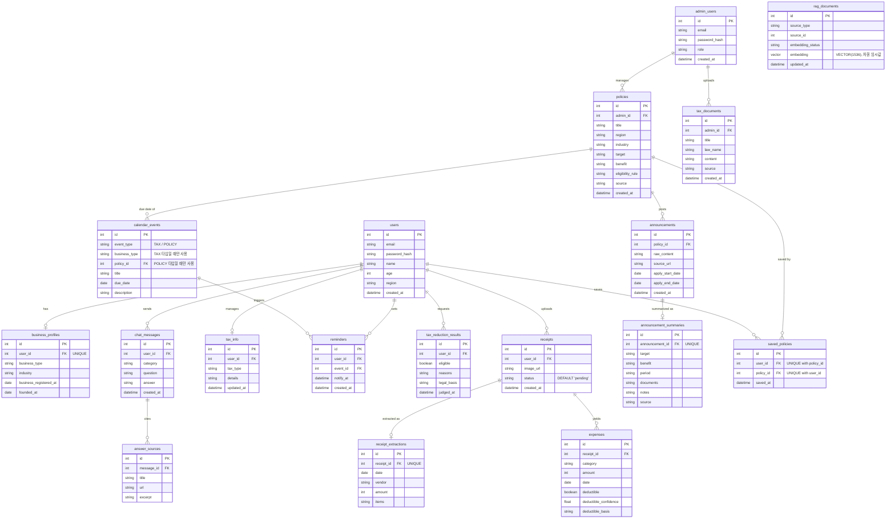

# ERD

`Docs/API_SPEC.md`, `Docs/FUNCTIONAL_SPEC.md`에서 드러난 데이터를 기준으로 정리한 관계형 스키마다.

## 모델링 노트

- **User – BusinessProfile**: 1:1. 개인정보(FS-03)와 사업자 정보(FS-04)를 분리해 API도 별도 엔드포인트로 관리한다.
- **User – ChatMessage – AnswerSource**: 챗봇 질의응답(FS-05~07)과 답변 근거(FS-08)를 1:N으로 연결해, 답변마다 근거 문서를 복수로 저장할 수 있게 한다.
- **CalendarEvent – Reminder**: `CalendarEvent`는 홈 화면 캘린더(FS-11)에 노출되는 일정 마스터 데이터로, `event_type`에 따라 세금 신고 일정(TAX, `business_type` 사용)과 지원정책 신청 마감일(POLICY, `policy_id` 사용)을 함께 담는다. `Reminder`는 사용자가 특정 일정(세금·지원금 무관)에 건 알림이다.
- **Policy – CalendarEvent**: 정책의 신청 마감일(`Announcement.apply_end_date`)을 기준으로 생성되는 POLICY 타입 `CalendarEvent`를 위한 관계다. `Announcement`에 `apply_start_date`/`apply_end_date` 구조화 필드를 추가한 이유는, `AnnouncementSummary.period`가 AI 요약 문자열이라 캘린더 렌더링에 쓸 신뢰 가능한 날짜 값이 아니기 때문이다.
- **Receipt – ReceiptExtraction – Expense**: 영수증 등록(FS-14) → OCR 추출 결과(FS-15, 1:1) → 지출 항목(FS-16, FS-17 포함, 1:N) 순서로 이어진다. 영수증 한 장에 여러 지출 항목이 나올 수 있어 `Expense`는 `Receipt`의 자식으로 둔다.
- **Policy – Announcement – AnnouncementSummary**: 정책(마스터 데이터) 하나에 여러 시점의 공고문이 달릴 수 있고(1:N), 공고문 하나는 AI 요약 결과 하나를 가진다(1:1).
- **User – Policy (SavedPolicy)**: 관심 정책 저장(FS-23)을 위한 다대다 조인 테이블.
- **AdminUser – Policy / TaxDocument**: 관리자가 등록한 데이터의 출처를 추적하기 위한 FK.
- **RagDocument**: `source_type`(`tax_document`/`policy`/`announcement`) + `source_id`로 원천 문서를 가리키는 논리적 참조다. 여러 테이블을 대상으로 하므로 DB 레벨 FK 제약은 걸지 않고, 벡터DB 임베딩 상태(FS-27)만 추적한다.
- **PolicyEligibility(FS-20)**: 별도 테이블로 저장하지 않는다. `Policy.eligibility_rule`과 `User`/`BusinessProfile` 값을 요청 시점에 비교해 계산하는 값이라 저장이 불필요하다.
- **시스템 모니터링(FS-28)**: 관계형 DB 엔티티로 모델링하지 않는다. 로그/지표 수집은 별도 관측 도구 영역으로 본다.

## 구현 노트

위 다이어그램은 `DB/01_schema.sql`(PostgreSQL + pgvector)의 실제 테이블 구조에 맞춰 동기화했다. 컬럼 단위 제약(`NOT NULL`, `ON DELETE CASCADE` 등)과 `01_schema.sql` 작성 시점의 세부 결정 사유는 중복 기술하지 않고 `DB/01_schema.sql` 하단 "ERD와 다른 사항" 주석을 참조한다.
