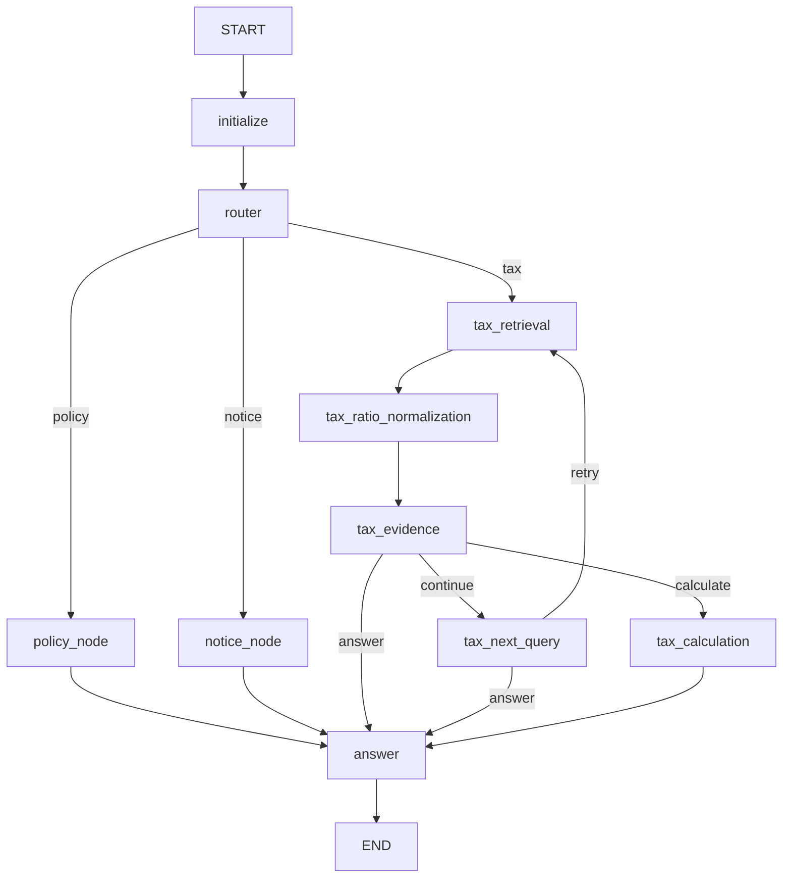

# LLM LangGraph 현재 구조 및 인수인계 가이드

이 문서는 현재 `LLM/` 코드의 실제 구현을 기준으로 작성한 AI/개발자용 인수인계
문서다. 설계 아이디어가 아니라 현재 코드가 어떻게 실행되는지 설명한다.

## 1. 핵심 요약

질문은 Structured Output Router에서 `policy`, `notice`, `tax` 중 하나로 분류된다.

- Policy: Dense + BM25 → RRF → Cohere Rerank → Unified Answer
- Notice: Backend가 전달한 실제 공고 결과 → Unified Answer
- Tax: Hybrid Retrieval → 비율 정규화 → Evidence 평가 → 필요 시 Multi-hop →
  선택적 deterministic 계산 → Unified Answer

Notice는 RAG를 사용하지 않는다. Tax 계산의 숫자는 LLM이 계산하지 않으며,
LLM은 `TaxCalculationPlan`만 만들고 `calculate_tax_plan()`이 `Decimal`로 계산한다.

## 2. 주요 파일 지도

| 파일 | 책임 |
| --- | --- |
| `src/rag/graph.py` | GraphState, 모든 node, conditional edge, Graph compile |
| `src/rag/tax.py` | Tax Evidence/Next Query/계산 계획 schema와 법령 참조 해석 |
| `src/rag/answer.py` | 공통 Structured Answer와 안전한 fallback |
| `src/data/tax_normalization.py` | `N분의 M` 비율의 deterministic 추출/표현 |
| `src/vectorstores/hybrid.py` | BM25, RRF, Dense+BM25 orchestration |
| `src/vectorstores/postgres.py` | pgvector 저장·Dense 검색 |
| `src/rag/reranker.py` | Cohere Rerank와 공통 결과 schema 유지 |
| `src/features/indexing.py` | DB/PDF 문서 Chunking 및 검색기 준비 |
| `src/data/postgres_repository.py` | PostgreSQL 원천 데이터의 읽기·정제 |
| `src/serving/rag_routes.py` | 실제 HTTP 진입점과 Graph 실행 |
| `src/serving/schemas.py` | Backend↔LLM 및 내부 API Pydantic 계약 |
| `src/core/config.py` | 모델, 검색, DB, Cohere, MAX_HOPS 설정 |

## 3. 실제 HTTP 진입점

### Backend 어댑터

- `GET /rag/ready`
- `POST /rag/reindex`
- `POST /rag/chat`

`POST /rag/chat`의 핵심 입력은 다음과 같다.

```json
{
  "category": "policy",
  "question": "질문",
  "userContext": null,
  "noticeResults": null
}
```

- `category`: `tax | expense | saving | policy`. Router 제안을 허용 route로 보정하는
  제약이다. `_route_for_category()`가 아래 표대로 결정적으로 적용한다
  (`Docs/Design/LLM_API_SPEC_V1.md` §3과 동일).

  | category | 허용 route |
  | --- | --- |
  | `tax` | `tax` |
  | `expense` | `tax` |
  | `saving` | `tax`, `policy` |
  | `policy` | `policy`, `notice` |

- `userContext`: Backend가 인증 사용자 정보로 조립한 선택값이다.
- `noticeResults`: Backend가 조회한 실제 공고 목록이다.
  - 필드 자체가 없거나 `null`: `integration_unavailable`
  - `[]`: Backend 조회 성공, 결과 0건이므로 `no_result`
  - 값이 있는 배열: Notice Answer Context로 사용

### 내부 호환 API

- `GET /internal/rag/ready`
- `POST /internal/rag/index`
- `POST /internal/rag/answer`
- `POST /internal/rag/recommendations`

`/rag/chat`과 `/internal/rag/answer`는 모두 `rag_routes._execute_graph()`를 통해
동일한 LangGraph를 실행한다. 정책 추천 endpoint는 기존 `PolicyDiscoveryService`
호환 경로를 유지한다.

## 4. Graph dependency 조립

`build_graph()`는 다음 의존성을 주입받는다.

- `llm`: Router, Evidence, Next Query, 계산 계획, Answer Structured Output
- `policy_search`: Policy용 `HybridSearch`
- `tax_search`: Tax용 `HybridSearch`; 없으면 `policy_search`를 공유
- `notice_search`: Backend가 전달한 공고 결과를 반환하는 일반 callable
- `rerank`: 테스트 대역 또는 Cohere reranker
- `tax_evidence_evaluator`, `tax_next_query_generator`,
  `tax_calculation_planner`: 테스트 가능한 선택적 대역
- `settings`: top-k, Cohere, `TAX_MAX_HOPS` 등

Backend 함수는 Tool이 아니다. `@tool`, `ToolNode`, Agent, ReAct를 사용하지 않는다.

## 5. GraphState

`GraphState`는 `TypedDict`이며 `query`만 필수 입력이다.

| 필드 | 작성 node/진입점 | 주요 사용처 |
| --- | --- | --- |
| `query` | HTTP entry | Router, 모든 branch, Answer |
| `category` | Backend adapter | Router 결과를 허용 route로 보정 |
| `policy_id`, `top_k`, `decision` | 내부 API | Policy 검색/Answer |
| `route`, `personalized` | Router | conditional route, Context 사용 |
| `user_context` | HTTP entry/initialize | 개인화 Query, Tax 판단/계산 계획 |
| `search_query` | Policy/Tax Next Query | 실제 검색 Query |
| `retrieved_docs` | Policy/Tax Retrieval | RRF 결과 또는 누적 후보 |
| `reranked_docs` | Policy/Tax Retrieval | 최종 근거 및 Answer |
| `normalized_ratios` | Tax Ratio node | Evidence와 Tax Answer Context |
| `hop_count`, `search_history` | Tax Retrieval | Multi-hop 제한/중복 방지 |
| `last_retrieval_count` | Tax Retrieval | 새 근거 없음 판단 |
| `evidence_sufficient` | Tax Evidence | 3-way routing, Answer status |
| `missing_information` | Tax Evidence | Next Query와 Answer |
| `missing_user_context` | Tax Evidence/Calculation | 즉시 종료 및 추가 입력 안내 |
| `calculation_required` | Tax Evidence | Calculation 진입 조건 |
| `calculation_result` | Tax Calculation | Tax Answer Context |
| `notice_results` | Notice node | Notice Answer Context |
| `notice_backend_available` | Notice node | no-result와 미연결 구분 |
| `termination_reason` | 각 branch | routing과 최종 status 결정 |
| `answer`, `answer_status` | Unified Answer | HTTP 응답 |
| `cited_source_numbers`, `answer_sources` | Unified Answer | 검증된 실제 출처 응답 |

## 6. 전체 Graph



## 7. Router

`RouteDecision`은 자유 문자열 parsing이 아닌 Structured Output이다.

```python
route: Literal["policy", "notice", "tax"]
personalized: bool
```

`personalized=True`는 사용자 Context가 필요한 질문이라는 뜻이다. 사용자 정보가
실제로 제공됐다는 뜻은 아니다.

## 8. Policy branch

1. `personalized=True`이고 `user_context`가 있으면 기존
   `build_personalized_query()`로 검색어를 만든다.
2. `HybridSearch.search_stages()`가 Dense와 BM25 결과를 얻는다.
3. `reciprocal_rank_fusion()`이 `chunk_id` 기준으로 결과를 결합한다.
4. `policy_id is not None`인 문서만 Policy 근거로 유지한다.
5. Cohere가 RRF 후보를 재정렬한다.
6. Cohere 설정/API 오류 시 RRF 상위 결과를 사용한다.
7. `reranked_docs`를 Unified Answer에 전달한다.

주요 종료 사유:

- `policy_retriever_unavailable`
- `retrieval_error`
- `no_result`
- `policy_evidence_ready`

## 9. Notice branch

Notice node는 Vector DB, BM25, RRF, Cohere를 호출하지 않는다.

- `notice_search is None`: `notice_integration_unavailable`
- Backend 호출 오류: `notice_backend_error`
- 정상 0건: `no_result`
- 정상 결과: `notice_results_ready`

실제 공고 필터, 모집 상태, 날짜 판단, SQL은 Backend 책임이다. LLM에 이 로직을
복제하지 않는다.

## 10. Tax branch

### 10.1 Retrieval

각 Hop은 기존 Hybrid Retrieval과 Cohere Rerank를 사용한다. 현재 Tax 문서는
`policy_id is None`이라는 규칙으로 Policy/Announcement 문서와 구분한다.

- 실제 검색을 실행할 때만 `hop_count` 증가
- 실행 Query는 `search_history`에 추가
- Query가 이미 history에 있으면 `duplicate_query`
- `TAX_MAX_HOPS` 이상이면 `max_hops`
- `merge_evidence()`가 `chunk_id` 기준으로 Hop 간 근거를 누적
- 새 Chunk가 없으면 `no_new_evidence`

### 10.2 Ratio Normalization

`tax_ratio_normalization` node는 LLM을 호출하지 않는다. 검색된 문서에서
`분모분의 분자` 패턴을 구조화한다.

```json
{
  "raw": "100분의 75",
  "numerator": 75,
  "denominator": 100,
  "percent": 75,
  "decimal": 0.75,
  "context": "원문 주변 문장",
  "chunk_id": "tax_document-..."
}
```

Normalizer는 이 값이 세율, 감면율, 공제율인지 판단하지 않고 실제 세액 계산도 하지
않는다. DB 원문, Chunk 본문, metadata를 변경하지 않으므로 이 단계 때문에 재색인할
필요가 없다. Prompt에 문서를 직렬화할 때는 이해 보조용으로 원문 옆에 `%`를 붙인다.

### 10.3 Evidence Evaluator

`TaxEvidenceDecision` Structured Output:

```python
sufficient: bool
missing_information: list[str]
missing_user_context: list[str]
calculation_required: bool
reason: str
```

Evidence 이후 routing은 반드시 다음 3-way 규칙을 유지한다.

1. `evidence_sufficient=True` + `calculation_required=True` → `calculate`
2. `evidence_sufficient=True` + 계산 불필요 → `answer`
3. Evidence 부족 + 종료 사유 없음 → `continue`
4. Evidence 부족 + 종료 사유 있음 → `answer`

`MAX_HOPS`에 도달해도 `evidence_sufficient=True`로 바꾸지 않는다.

### 10.4 Reference와 Next Query

`resolve_legal_reference()`가 LLM Query 생성보다 먼저 실행된다.

최소 지원 패턴:

- `○○법 제N조`
- `○○법 시행령 제N조`
- `같은 법 제N조`
- `제N조에 따른`
- `대통령령으로 정하는`

명시적 참조를 찾지 못했을 때만 `TaxNextQuery` Structured Output을 호출한다.

```python
query: str | None
target_law: str | None
target_article: str | None
reason: str
```

새 Query가 있으면 `retry → tax_retrieval`, 없거나 중복/오류이면
`answer`로 직접 이동한다. Next Query 실패는 계산 필요를 뜻하지 않는다.

### 10.5 Calculation

`tax_calculation`은 다음 두 조건을 모두 만족할 때만 진입한다.

```python
evidence_sufficient is True
calculation_required is True
```

`TaxCalculationPlan`은 OpenAI Structured Output 호환을 위해 금액과 비율을 숫자
문자열로 받는다. `Decimal` 타입을 schema에 직접 사용하면 일부 OpenAI response
format에서 지원하지 않는 regex가 생성되므로 다시 사용하지 않는다.

```python
calculation_type: Literal[
    "percentage_of_amount",
    "reduction_amount",
    "amount_after_reduction",
]
base_amount: str | None
rate_percent: str | None
missing_inputs: list[str]
cited_source_numbers: list[int]
reason: str
```

`calculate_tax_plan()`의 검증 순서:

1. 필수 입력 존재 확인
2. 문자열을 `Decimal`로 변환
3. 기준금액 음수 및 비율 0~100 범위 확인
4. 출처 번호 범위 확인
5. 해당 비율이 인용 문서 원문에 실제 존재하는지 확인
6. Python `Decimal`로 계산

지원 계산은 기준금액의 비율, 감면액, 감면 후 금액뿐이다. 과세표준 산출, 자격 판정,
누진세, 공제 순서 등은 이 모듈의 책임이 아니다.

## 11. Unified Answer

모든 branch는 하나의 `answer` node로 합류한다.

`UnifiedAnswerResult`:

```python
answer: str
status: Literal[
    "success",
    "need_more_info",
    "insufficient_evidence",
    "no_result",
    "integration_unavailable",
    "error",
]
cited_source_numbers: list[int]
```

- 성공 시 현재 route에 필요한 Context만 LLM에 전달한다.
- 실패/무결과/미연결은 `fallback_answer()`로 결정적으로 응답한다.
- 출처 metadata를 LLM이 생성하게 하지 않는다.
- LLM이 선택한 번호를 실제 source 개수와 대조한다.
- 중복 source는 `chunk_id`, `id`, `notice_id` 우선으로 제거한다.
- Answer node는 검색, Evidence 판단, Next Query, 계산을 수행하지 않는다.

## 12. termination_reason → 사용자 상태

대표 매핑은 다음과 같다.

| termination_reason | answer_status |
| --- | --- |
| retriever/integration unavailable | `integration_unavailable` |
| `missing_user_context`, `missing_calculation_input` | `need_more_info` |
| `no_result` 또는 근거 문서 없음 | `no_result` |
| MAX_HOPS, 중복 Query, 새 근거 없음 | `insufficient_evidence` |
| retrieval/evidence/query/plan 내부 오류 | `error` |
| 계산 비율·출처 검증 실패 | `insufficient_evidence` |
| 근거 충분/계산 완료 | `success` |

정확한 최종 매핑은 `graph._answer_status()`가 source of truth다.

## 13. 검색 및 인덱스 생명주기

PostgreSQL 원천:

- `policies`
- `announcements`
- `tax_documents`

파생 Vector 저장소는 `rag_documents`다. 원본 테이블은 인덱싱 과정에서 읽기 전용으로
취급한다.

현재 `RagRuntime.ready`는 DB에 Embedding이 존재한다는 뜻이 아니라 현재 프로세스에
검색 객체가 조립됐다는 뜻이다. 서버를 재시작하면 pgvector 데이터는 남지만
메모리의 BM25/HybridSearch는 다시 준비해야 한다.

현재는 `/rag/reindex` 또는 `/internal/rag/index`가 검색기를 준비한다. 내용 hash가
같으면 Embedding을 재사용하지만, 운영 환경에서는 서버 startup 시 기존 DB 인덱스를
읽기 전용으로 자동 로드하는 개선이 필요하다.

## 14. 주요 환경변수

```dotenv
PORT=8001
DATABASE_URL=...
VECTOR_STORE_BACKEND=postgres
LLM_MODEL=...
EMBEDDING_MODEL=text-embedding-3-small
OPENAI_API_KEY=...
RETRIEVAL_MODE=hybrid
HYBRID_DENSE_CANDIDATE_K=20
HYBRID_BM25_CANDIDATE_K=20
HYBRID_RRF_K=60
COHERE_API_KEY=...
COHERE_RERANK_MODEL=rerank-v4.0-fast
COHERE_RERANK_CANDIDATE_K=20
TAX_MAX_HOPS=3
```

실제 secret을 코드·문서·로그에 기록하지 않는다. Cohere가 미설정이면 RRF fallback을
사용한다.

## 15. 현재 알려진 제한사항

1. 검색기 자동 startup load가 아직 없다.
2. Notice의 실제 조회/필터는 Backend가 `noticeResults`를 전달해야 동작한다.
3. Tax와 Policy가 같은 Hybrid corpus를 공유하며 검색 후 `policy_id`로 분리된다.
   후보가 서로를 과도하게 밀어내는지 실제 평가가 필요하다.
4. Tax Ratio Normalizer는 값만 추출하며 비율의 법적 의미는 Evidence 단계가 판단한다.
5. Tax 계산은 단순 비율 계산만 지원한다.
6. Cohere가 없거나 실패하면 RRF로 동작하므로 결과 품질 차이를 평가해야 한다.
7. 원본 PDF는 Git에서 제외되어 있으며 일부 PDF 테스트는 로컬 파일이 있어야 한다.

## 16. 테스트

```powershell
cd LLM
uv run pytest -q
```

현재 전체 테스트 기준은 `190 passed`다. 주요 테스트:

- `tests/test_graph.py`: Router, Policy/Notice branch, isolation
- `tests/test_tax_graph.py`: single/multi-hop, 3-way edge, Reference 우선, MAX_HOPS,
  계산 진입 조건, deterministic 계산
- `tests/test_tax_document_preprocessing.py`: 비율 추출, 원문 보존
- `tests/test_reranker.py`: Cohere metadata 보존
- `tests/test_rag_api.py`: 실제 HTTP entry와 Backend adapter 계약
- `tests/test_evaluator.py`, `tests/test_evaluation_metrics.py`: 평가 호환성

## 17. 변경 시 반드시 지킬 불변 조건

1. Notice를 RAG로 대체하지 않는다.
2. Evidence 부족 상태를 계산 node로 보내지 않는다.
3. Next Query의 실패/중복/없음은 `answer`로 보낸다.
4. `MAX_HOPS`를 근거 충분으로 바꾸지 않는다.
5. Ratio Normalizer는 원문을 수정하거나 세금을 계산하지 않는다.
6. LLM에게 실제 산술 결과를 맡기지 않는다.
7. 계산 비율은 인용 문서 원문에 실제 존재해야 한다.
8. LLM이 source metadata를 생성하게 하지 않는다.
9. Backend 함수는 Tool Calling이나 Agent로 노출하지 않는다.
10. DB 원본, 원본 PDF, 실제 secret을 변경하거나 커밋하지 않는다.

## 18. 다음 작업 권장 순서

1. 서버 startup 시 기존 pgvector + BM25 자동 로드
2. Backend의 실제 `userContext`, `noticeResults` 전달 연결
3. Policy와 Tax source_type 사전 필터 개선 및 retrieval 평가
4. 실제 Tax 질문셋으로 Hop 수, Evidence 정확도, Reference 추적 평가
5. Dense / Hybrid / Hybrid+Cohere 비교 평가
